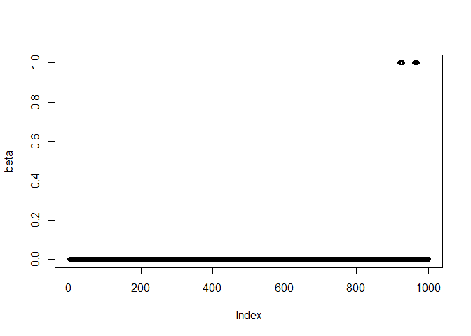
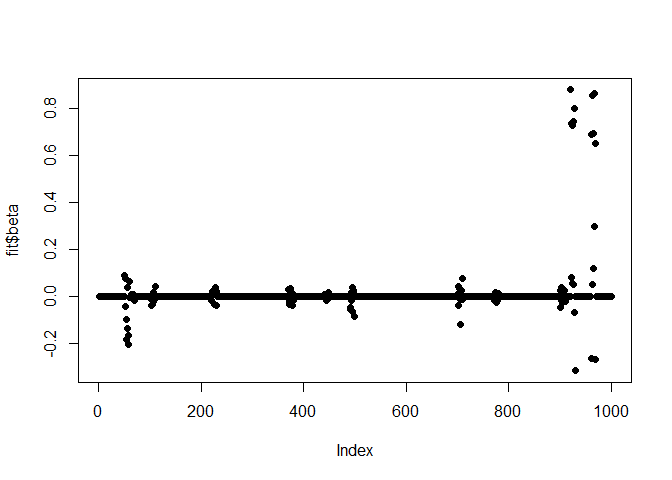

<!-- README.md is generated from README.Rmd. Please edit that file -->

# autotunegg

<!-- badges: start -->

<!-- badges: end -->

autotunegg provides a fast, cross validation-free tuning for the group
lasso with least squares loss.

## Installation

You can install the development version of autotunegg from
[GitHub](https://github.com/) with:

``` r
# install.packages("pak")
pak::pak("stevebroll/autotunegg")
#> ℹ Loading metadata database✔ Loading metadata database ... done
#>  
#> → Package library at 'C:\Users\steve\AppData\Local\R\win-library\4.6'.
#> ℹ No downloads are needed
#> ✔ 1 pkg + 2 deps: kept 3 [8s]
```

## Example Usage:

``` r
# generate simple data
library(autotunegg)
set.seed(2026)
n <- 100
pg <- 10
p <- pg*n
group <- rep(1:n, each = pg)
# 2 target groups (beta = 1)
s <- 2*pg
beta <- rep(0, p); beta[group == sample(unique(group), 2)] = 1
x <- matrix(rnorm(n*p),n,p)
snr <- 4
error.sd <- sqrt(sum(beta^2)/ snr)
err <- rnorm(n, 0, error.sd)
y <- x %*% beta + err
fit <- autotunegg(x, y, group, active = T, trace_it = T)
#> Iteration: 1Iteration: 2
#> No of predictor group significant for sigma estimation:
#> Warning in autotunegg_bcd_cpp(xin = x, yin = y, alpha = alpha, group = group, :
#> subscript out of bounds (index 23 >= vector size 2)
#> 0
# # plot beta's
plot(beta, pch = 1)
```



``` r
plot(fit$beta, pch = 16)
```



``` r
# print confusion matrix
table(beta != 1, fit$beta != 0)
#>        
#>         FALSE TRUE
#>   FALSE     0   10
#>   TRUE    880  110
# Estimated \eqn{\hat \sigma^2} path vs empirical
fit$CD.path.details$count_sig_beta
#> NULL
var(err)
#> [1] 2.485548
```
